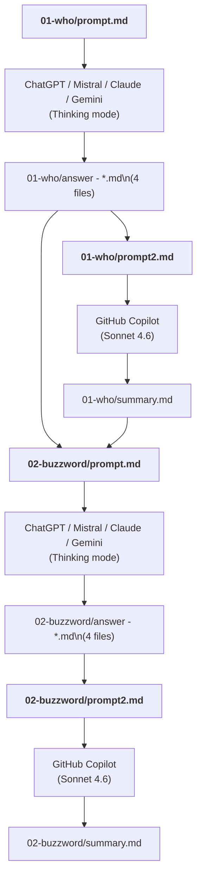

# Buzzword Search for the smaller oil producing countries

click [here](https://github.com/ulf1/research-oil-countries/blob/master/02-buzzword/summary.md) for the final result. 

## Approach:

- `01-who/prompt.md` generated the four `01-who/answer - *.md` files (using ChatGPT, Mistral, Claude, Gemini websites; all Thinking mode)
- `01-who/prompt2.md` merges the four `01-who/answer - *.md` files into `01-who/summary.md` (using github copilot with Sonnet 4.6)
- `02-buzzword/prompt.md` and `01-who/summary.md` and `01-who/answer - *.md` generate `02-buzzword/answer - *.md` files (using ChatGPT, Mistral, Claude, Gemini websites; all Thinking mode)
- `02-buzzword/prompt2.md` merges the four `02-buzzword/answer - *.md` files into `02-buzzword/summary.md` (using github copilot with Sonnet 4.6)

a brief note: ChatGPT is usually a bit more "creative" (=when you don't mind hallucination). Mistral has stronger multi-lingual support embedded in its LLM. Analysis jobs with Claude take forever, i.e. it tries to drill deep (looks recursive to me. it took over an 1 hour). Gemini tries to contain the slop, i.e. it tends to cut the answer and stick to the major points. Thus, use an "ensemble" of tools to avoid missing something. 

a brief note about prompting: A basic pattern is "generate -> evaluate -> ...". This can be direct, e.g. "Find something ... ->  Assess each point by ...". It can be indirect, e.g. "Find oil countries -> Find oil companies doing it". 

## Flow Diagram

